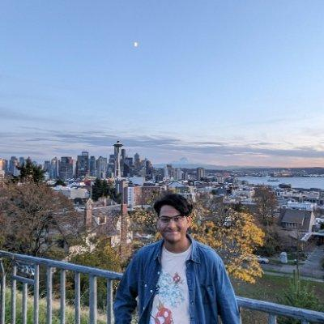

## About Me

Hi! I am a junior at Indiana University studying Computer Science, with minors in Math and Data Science.

## Interests

I'm interested in computer graphics and backend development.

## Personal
In my free time, I enjoy playing [chess](https://www.chess.com/member/sparsh-n) and badminton. Occasionally, I also go mountain biking and (very rarely) ice skating.

I also enjoy reading some of the (many) thought provoking papers from [SIGBOVIK](https://www.sigbovik.org). Give it a read if you have time :)

<!-- ## Publications

1. F.Bar, J.Doe: Effects of having a placeholder of a name
2. S.Holmes, J.Watson: Consequences of living with a sociopath in London

## Typography

This is a [link](http://google.com). Something *italics* and something **bold**.

Here is a table

Year | Award | Category
-----|-------|--------
2014 | Emmy  | Won Outstanding Lead Actor in a miniseries or a movie
2015 | BAFTA | Nominated for Best Leading Actor for Sherlock
2014 | Satellite | Won Best Actor miniseries or television film

Here is a horizontal rule

---

Here is a blockquote

> To a great mind, nothing is little

## References

* Foo Bar: Head of Department, Placeholder Names, Lorem
* John Doe: Associate Professor, Department of Computer Science, Ipsum
-->
